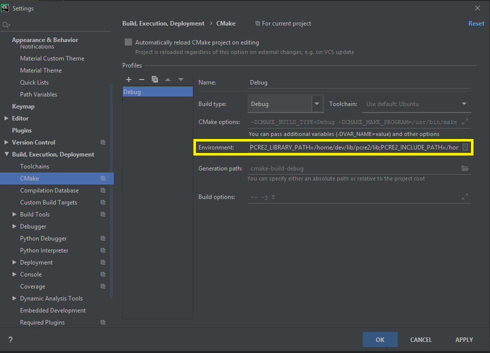

# Template for CMAKE

## Introduction

This Cmake template illustrates the following use case:

* Your project depends on an external library (made of a set of header
  files and an archive) installed in a non-standard location
  (for example: `/home/dev/lib/pcre2`).
* You want the current date of compilation to be included
  into the application's binary.

## CMakeLists.txt

### Configuring the path to the external library components

In this case you need to:
* tell the compiler where to search for header files.
* tell the linker where to search for archives.

With Cmake, you do that by calling `include_directories(...)` and `link_directories(...)`.

For examples:

    include_directories(/path/to/headers)
    link_directories(/path/to/libraries)

But you should not hard code the list of paths. It is better to set the paths
through the use of environment variables.   

For examples:

    include_directories($ENV{PCRE2_INCLUDE_PATH})
    link_directories($ENV{PCRE2_LIBRARY_PATH})    
    
OK. That's better. However, you should test that we can find the required dependencies (the header files
and the archives) prior to launching the build process.

    # You need the module "CheckIncludeFiles"
    include(CheckIncludeFiles)
    
    # Try to find an archive.
    find_library(LIB_PCRE2 pcre2-8 HINTS ENV PCRE2_LIBRARY_PATH)
    if(NOT LIB_PCRE2)
        message(FATAL_ERROR "PCRE2 library not found. Please configure PCRE2_LIBRARY_PATH.")
    else()
        message("OK: PCRE2 library found")
    endif()
    
    # Try to find an header file.
    set(CMAKE_REQUIRED_INCLUDES "${CMAKE_BINARY_DIR}/extra;$ENV{PCRE2_INCLUDE_PATH}")
    CHECK_INCLUDE_FILES("pcre2_header_tester.h" HEADERS_PCRE2 LANGUAGE C)
    if(NOT HEADERS_PCRE2)
        message(FATAL_ERROR "PCRE2 header files not found. Please configure PCRE2_INCLUDE_PATH.")
    else()
        message("OK: PCRE2 header files found")
    endif()

> For details, see [CMakeLists.txt](CMakeLists.txt).

### Generating the current date representation

The program [extra/version.c](extra/version.c) is used to generate a header file that contains
the current date representation.

The command:

    ./bin/version.exe src/date.h

Will create the file `src/date.h` which looks something like:

    #ifndef VERSION
    #define VERSION "2020-06-17 14:55:28"
    #endif

This header file is then included from within the application.

In the file [CMakeLists.txt](CMakeLists.txt), we create a custom target that runs a command:

    add_custom_target(version
            COMMAND bin/version.exe src/date.h
            COMMENT "Create the date that represents the version"
            )
    add_dependencies(version version.exe)

> This target is executed **unconditionally** whenever another target depends on it.

We make the target for the application (`app.exe`) to depend on target `version`:

    add_executable(app.exe src/main.c src/toolbox.c src/toolbox.h src/date.h)
    add_dependencies(app.exe version)

Before the target `app.exe` is built, the custom target `version` is evaluated.
Thus, the header file `src/date.h` is regenerated before the application is built. 

## Building the application

Before you run Cmake, you must set the environment variables:

    export PCRE2_LIBRARY_PATH=/home/dev/lib/pcre2/lib
    export PCRE2_INCLUDE_PATH=/home/dev/lib/pcre2/include

Running CMake on this project will give:

    $ cmake .
    CMAKE_SOURCE_DIR: /home/dev/projects/cmake_template1
    Path to PCRE2 library (PCRE2_LIBRARY_PATH): /home/dev/lib/pcre2/lib
    Path to PCRE2 headers (PCRE2_INCLUDE_PATH): /home/dev/lib/pcre2/include
    OK: PCRE2 library found
    Expect the test header "pcre2_header_tester.h" to be under "/home/dev/projects/cmake_template1/extra"
    OK: PCRE2 header files found
    -- Configuring done
    -- Generating done
    -- Build files have been written to: /home/dev/projects/cmake_template1

    $ make
    [ 33%] Built target version.exe
    [ 50%] Create the date that represents the version
    [ 50%] Built target version
    Scanning dependencies of target app.exe
    [ 66%] Building C object CMakeFiles/app.exe.dir/src/main.c.o
    [ 83%] Linking C executable bin/app.exe
    [100%] Built target app.exe

## Notes about CLion in full remote mode

If you use CLion in full remote mode, then you must configure the CMake launcher
(**File** | **Settings** | **Build, Execution, Deployment** | **CMake** | **Environment**).

> You should also reset the Cmake cache and reaload the project
> (**Tools** | **CMake** | **Reset Cache and Reload Project**).

